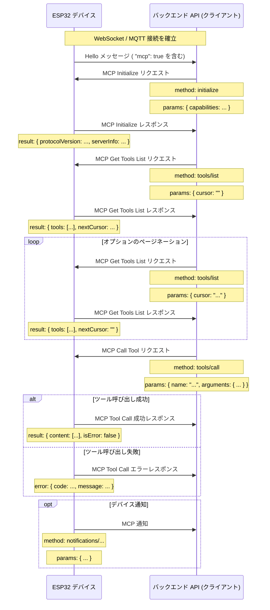

# MCP (Model Context Protocol) インタラクションフロー

NOTICE: AIによる補助生成です。バックエンドサービスを実装する際は、コードを参照して詳細を確認してください。

このプロジェクトのMCPプロトコルは、バックエンドAPI（MCPクライアント）とESP32デバイス（MCPサーバー）間の通信に使用され、バックエンドがデバイス提供の機能（ツール）を発見し、呼び出すことを可能にします。

## プロトコルフォーマット

コード（`main/protocols/protocol.cc`, `main/mcp_server.cc`）に基づき、MCPメッセージは基本的な通信プロトコル（WebSocketやMQTTなど）のメッセージボディにカプセル化されています。その内部構造は[JSON-RPC 2.0](https://www.jsonrpc.org/specification)仕様に準拠しています。

メッセージ構造の例：

```json
{
  "session_id": "...", // セッションID
  "type": "mcp",       // メッセージタイプ、固定で "mcp"
  "payload": {         // JSON-RPC 2.0 ペイロード
    "jsonrpc": "2.0",
    "method": "...",   // メソッド名 (例: "initialize", "tools/list", "tools/call")
    "params": { ... }, // メソッドのパラメータ (リクエスト用)
    "id": ...,         // リクエストID (リクエストとレスポンス用)
    "result": { ... }, // メソッド実行結果 (成功レスポンス用)
    "error": { ... }   // エラー情報 (エラーレスポンス用)
  }
}
```

`payload`部分は標準的なJSON-RPC 2.0メッセージです：

- `jsonrpc`: 固定文字列 "2.0"。
- `method`: 呼び出すメソッド名（リクエスト用）。
- `params`: メソッドのパラメータ、構造化された値で、通常はオブジェクト（リクエスト用）。
- `id`: リクエストの識別子。クライアントがリクエストを送信する際に提供し、サーバーが応答する際にそのまま返します。リクエストと応答を一致させるために使用されます。
- `result`: メソッドが正常に実行された場合の結果（成功レスポンス用）。
- `error`: メソッドの実行に失敗した場合のエラー情報（エラーレスポンス用）。

## インタラクションフローと送信タイミング

MCPのインタラクションは、主にクライアント（バックエンドAPI）がデバイス上の「ツール」を発見し、呼び出すことを中心に行われます。

1.  **接続確立と能力通知**

    - **タイミング：** デバイスが起動し、バックエンドAPIに正常に接続された後。
    - **送信者：** デバイス。
    - **メッセージ：** デバイスは基本プロトコルの "hello" メッセージをバックエンドAPIに送信します。メッセージには、デバイスがサポートする能力のリストが含まれます。例えば、`CONFIG_IOT_PROTOCOL_MCP`設定によってMCPプロトコルをサポートすることを示します（`"mcp": true`）。
    - **例 (MCPペイロードではなく、基本プロトコルのメッセージ):**
      ```json
      {
        "type": "hello",
        "version": ...,
        "features": {
          "mcp": true,
          ...
        },
        "transport": "websocket", // または "mqtt"
        "audio_params": { ... },
        "session_id": "..." // デバイスがサーバーのhelloを受信した後に設定される可能性あり
      }
      ```

2.  **MCPセッションの初期化**

    - **タイミング：** バックエンドAPIがデバイスの "hello" メッセージを受信し、デバイスがMCPをサポートしていることを確認した後、通常はMCPセッションの最初のリクエストとして送信されます。
    - **送信者：** バックエンドAPI（クライアント）。
    - **メソッド：** `initialize`
    - **メッセージ (MCPペイロード):**

      ```json
      {
        "jsonrpc": "2.0",
        "method": "initialize",
        "params": {
          "capabilities": {
            // クライアントの能力、オプション

            // カメラビジョン関連
            "vision": {
              "url": "...", // カメラ: 画像処理アドレス(httpアドレスである必要があり、websocketアドレスではない)
              "token": "..." // urlトークン
            }

            // ... その他のクライアント能力
          }
        },
        "id": 1 // リクエストID
      }
      ```

    - **デバイスの応答タイミング：** デバイスが`initialize`リクエストを受信して処理した後。
    - **デバイスの応答メッセージ (MCPペイロード):**
      ```json
      {
        "jsonrpc": "2.0",
        "id": 1, // リクエストIDに一致
        "result": {
          "protocolVersion": "2024-11-05",
          "capabilities": {
            "tools": {} // ここでは詳細なツール情報はリストされず、tools/listが必要
          },
          "serverInfo": {
            "name": "...", // デバイス名 (BOARD_NAME)
            "version": "..." // デバイスのファームウェアバージョン
          }
        }
      }
      ```

3.  **デバイスツールリストの発見**

    - **タイミング：** バックエンドAPIがデバイスで現在サポートされている具体的な機能（ツール）のリストとその呼び出し方法を取得する必要がある場合。
    - **送信者：** バックエンドAPI（クライアント）。
    - **メソッド：** `tools/list`
    - **メッセージ (MCPペイロード):**
      ```json
      {
        "jsonrpc": "2.0",
        "method": "tools/list",
        "params": {
          "cursor": "" // ページネーション用、初回リクエストは空文字列
        },
        "id": 2 // リクエストID
      }
      ```
    - **デバイスの応答タイミング：** デバイスが`tools/list`リクエストを受信し、ツールリストを生成した後。
    - **デバイスの応答メッセージ (MCPペイロード):**
      ```json
      {
        "jsonrpc": "2.0",
        "id": 2, // リクエストIDに一致
        "result": {
          "tools": [ // ツールオブジェクトのリスト
            {
              "name": "self.get_device_status",
              "description": "...",
              "inputSchema": { ... } // パラメータスキーマ
            },
            {
              "name": "self.audio_speaker.set_volume",
              "description": "...",
              "inputSchema": { ... } // パラメータスキーマ
            }
            // ... その他のツール
          ],
          "nextCursor": "..." // リストが大きい場合、次のリクエストのカーソル値が含まれる
        }
      }
      ```
    - **ページネーション処理：** `nextCursor`フィールドが空でない場合、クライアントは再度`tools/list`リクエストを送信し、`params`にこの`cursor`値を含めて次のページのツールを取得する必要があります。

4.  **デバイスツールの呼び出し**

    - **タイミング：** バックエンドAPIがデバイス上の特定の機能を実行する必要がある場合。
    - **送信者：** バックエンドAPI（クライアント）。
    - **メソッド：** `tools/call`
    - **メッセージ (MCPペイロード):**
      ```json
      {
        "jsonrpc": "2.0",
        "method": "tools/call",
        "params": {
          "name": "self.audio_speaker.set_volume", // 呼び出すツール名
          "arguments": {
            // ツールパラメータ、オブジェクト形式
            "volume": 50 // パラメータ名とその値
          }
        },
        "id": 3 // リクエストID
      }
      ```
    - **デバイスの応答タイミング：** デバイスが`tools/call`リクエストを受信し、対応するツール関数を実行した後。
    - **デバイスの成功応答メッセージ (MCPペイロード):**
      ```json
      {
        "jsonrpc": "2.0",
        "id": 3, // リクエストIDに一致
        "result": {
          "content": [
            // ツール実行結果の内容
            { "type": "text", "text": "true" } // 例：set_volumeはboolを返す
          ],
          "isError": false // 成功を示す
        }
      }
      ```
    - **デバイスの失敗応答メッセージ (MCPペイロード):**
      ```json
      {
        "jsonrpc": "2.0",
        "id": 3, // リクエストIDに一致
        "error": {
          "code": -32601, // JSON-RPCエラーコード、例: Method not found (-32601)
          "message": "Unknown tool: self.non_existent_tool" // エラー説明
        }
      }
      ```

5.  **デバイスからの自発的なメッセージ送信 (Notifications)**
    - **タイミング：** デバイス内部でバックエンドAPIに通知する必要があるイベントが発生した場合（例：状態変化。コード例にはこのようなツールを送信する明確な記述はないが、`Application::SendMcpMessage`の存在はデバイスが自発的にMCPメッセージを送信する可能性を示唆している）。
    - **送信者：** デバイス（サーバー）。
    - **メソッド：** `notifications/`で始まるメソッド名、またはその他のカスタムメソッドである可能性があります。
    - **メッセージ (MCPペイロード):** JSON-RPC Notification形式に従い、`id`フィールドはありません。
      ```json
      {
        "jsonrpc": "2.0",
        "method": "notifications/state_changed", // メソッド名の例
        "params": {
          "newState": "idle",
          "oldState": "connecting"
        }
        // idフィールドなし
      }
      ```
    - **バックエンドAPIの処理：** Notificationを受信した後、バックエンドAPIは対応する処理を行いますが、応答はしません。

## インタラクション図

以下は、主要なMCPメッセージフローを示す簡略化されたインタラクションシーケンス図です。



このドキュメントは、このプロジェクトにおけるMCPプロトコルの主要なインタラクションフローを概説したものです。具体的なパラメータの詳細やツールの機能については、`main/mcp_server.cc`の`McpServer::AddCommonTools`および各ツールの実装を参照する必要があります。