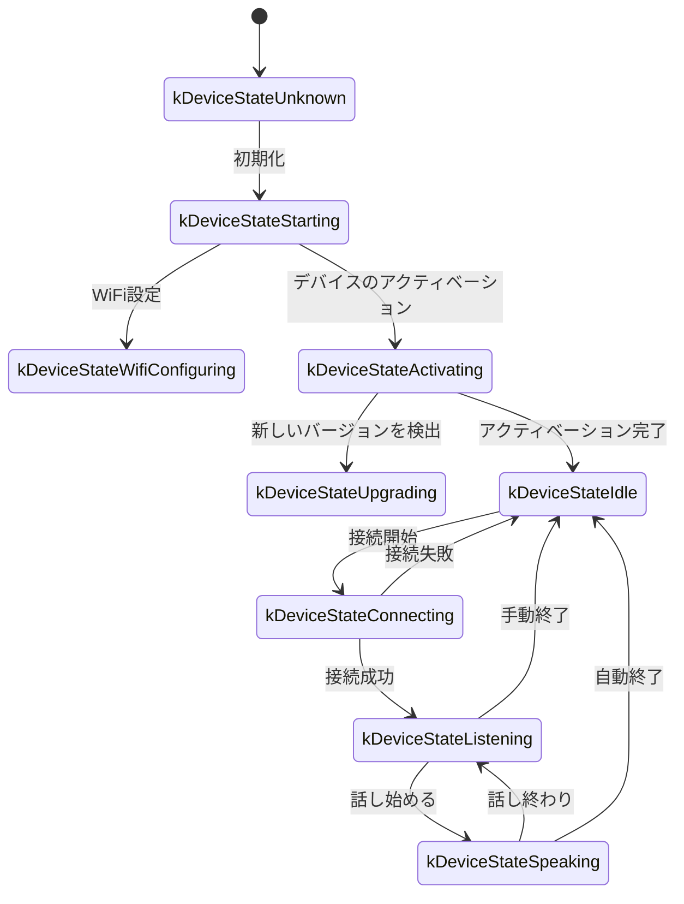
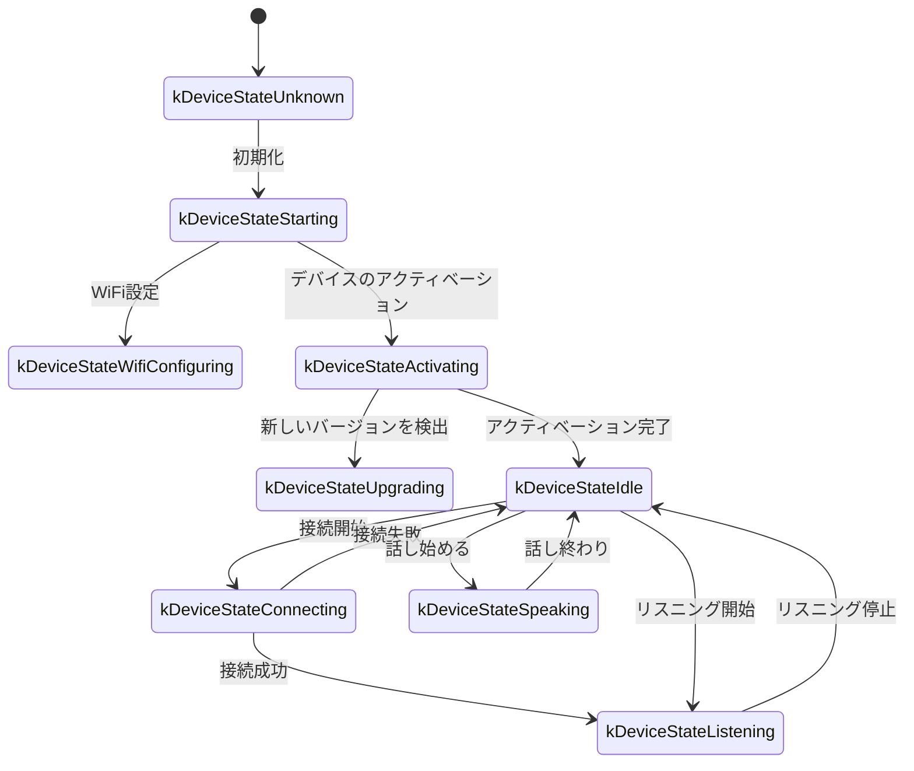

以下は、コード実装に基づいて整理されたWebSocket通信プロトコルのドキュメントであり、デバイス側とサーバー側がWebSocketを介してどのように対話するかを概説します。

このドキュメントは、提供されたコードから推測されたものであり、実際の実装ではサーバー側の実装と合わせてさらに確認または補足が必要になる場合があります。

---

## 1. 全体的なフローの概要

1. **デバイス側の初期化**
   - デバイスの電源投入、`Application`の初期化：
     - オーディオコーデック、ディスプレイ、LEDなどを初期化
     - ネットワークに接続
     - `Protocol`インターフェースを実装するWebSocketプロトコルインスタンス（`WebsocketProtocol`）を作成および初期化
   - メインループに入り、イベント（オーディオ入力、オーディオ出力、タスクのスケジューリングなど）を待機します。

2. **WebSocket接続の確立**
   - デバイスが音声セッションを開始する必要がある場合（ユーザーによるウェイクアップ、手動ボタンのトリガーなど）、`OpenAudioChannel()`を呼び出します：
     - 設定に基づいてWebSocket URLを取得
     - いくつかのリクエストヘッダー（`Authorization`, `Protocol-Version`, `Device-Id`, `Client-Id`）を設定
     - `Connect()`を呼び出してサーバーとのWebSocket接続を確立

3. **デバイス側からの「hello」メッセージの送信**
   - 接続に成功すると、デバイスは次のような構造のJSONメッセージを送信します：
   ```json
   {
     "type": "hello",
     "version": 1,
     "features": {
       "mcp": true
     },
     "transport": "websocket",
     "audio_params": {
       "format": "opus",
       "sample_rate": 16000,
       "channels": 1,
       "frame_duration": 60
     }
   }
   ```
   - `features`フィールドはオプションで、内容はデバイスのコンパイル設定に基づいて自動的に生成されます。たとえば、`"mcp": true`はMCPプロトコルをサポートしていることを示します。
   - `frame_duration`の値は`OPUS_FRAME_DURATION_MS`（たとえば60ms）に対応します。

4. **サーバーからの「hello」への応答**
   - デバイスは、サーバーから`"type": "hello"`を含むJSONメッセージが返されるのを待ち、`"transport": "websocket"`が一致するかどうかを確認します。
   - サーバーはオプションで`session_id`フィールドを送信でき、デバイス側は受信後に自動的に記録します。
   - 例：
   ```json
   {
     "type": "hello",
     "transport": "websocket",
     "session_id": "xxx",
     "audio_params": {
       "format": "opus",
       "sample_rate": 24000,
       "channels": 1,
       "frame_duration": 60
     }
   }
   ```
   - 一致する場合、サーバーの準備ができたと見なされ、オーディオチャネルが正常に開かれたことを示します。
   - タイムアウト時間（デフォルトは10秒）内に正しい応答を受信しない場合、接続は失敗したと見なされ、ネットワークエラーコールバックがトリガーされます。

5. **後続のメッセージ交換**
   - デバイス側とサーバー側は、主に2種類のデータを送信できます：
     1. **バイナリオーディオデータ**（Opusエンコード）
     2. **テキストJSONメッセージ**（チャットステータス、TTS/STTイベント、MCPプロトコルメッセージなどの転送に使用）

   - コードでは、受信コールバックは主に次のように分かれています：
     - `OnData(...)`:
       - `binary`が`true`の場合、オーディオフレームと見なされます。デバイスはそれをOpusデータとしてデコードします。
       - `binary`が`false`の場合、JSONテキストと見なされ、デバイス側でcJSONを使用して解析し、対応するビジネスロジック（チャット、TTS、MCPプロトコルメッセージなど）を処理する必要があります。

   - サーバーまたはネットワークが切断されると、`OnDisconnected()`コールバックがトリガーされます：
     - デバイスは`on_audio_channel_closed_()`を呼び出し、最終的にアイドル状態に戻ります。

6. **WebSocket接続のクローズ**
   - デバイスは、音声セッションを終了する必要がある場合、`CloseAudioChannel()`を呼び出して接続をアクティブに切断し、アイドル状態に戻ります。
   - または、サーバー側がアクティブに切断した場合も、同じコールバックフローがトリガーされます。

---

## 2. 一般的なリクエストヘッダー

WebSocket接続を確立する際、コード例では次のリクエストヘッダーが設定されています：

- `Authorization`: アクセストークンを格納するために使用されます。形式は`"Bearer <token>"`です。
- `Protocol-Version`: 固定例では`"1"`で、helloメッセージ本文の`version`フィールドと一致します。
- `Device-Id`: デバイスの物理ネットワークカードのMACアドレス。
- `Client-Id`: ソフトウェアで生成されたUUID（NVSを消去するか、完全なファームウェアを再書き込みするとリセットされます）。

これらのヘッダーはWebSocketハンドシェイクとともにサーバーに送信され、サーバーは必要に応じて検証、認証などを行うことができます。

---

## 3. JSONメッセージの構造

WebSocketテキストフレームはJSON形式で転送されます。以下は、一般的な`"type"`フィールドとそれに対応するビジネスロジックです。メッセージにリストされていないフィールドが含まれている場合、それはオプションまたは特定の実装の詳細である可能性があります。

### 3.1 デバイス側→サーバー

1. **Hello**
   - 接続成功後、デバイス側から送信され、サーバーに基本パラメータを通知します。
   - 例：
     ```json
     {
       "type": "hello",
       "version": 1,
       "features": {
         "mcp": true
       },
       "transport": "websocket",
       "audio_params": {
         "format": "opus",
         "sample_rate": 16000,
         "channels": 1,
         "frame_duration": 60
       }
     }
     ```

2. **Listen**
   - デバイス側が録音リスニングを開始または停止したことを示します。
   - 一般的なフィールド：
     - `"session_id"`：セッション識別子
     - `"type": "listen"`
     - `"state"`：`"start"`, `"stop"`, `"detect"`（ウェイクアップ検出がトリガーされた）
     - `"mode"`：`"auto"`, `"manual"` または `"realtime"`、認識モードを示します。
   - 例：リスニング開始
     ```json
     {
       "session_id": "xxx",
       "type": "listen",
       "state": "start",
       "mode": "manual"
     }
     ```

3. **Abort**
   - 現在の話（TTS再生）または音声チャネルを終了します。
   - 例：
     ```json
     {
       "session_id": "xxx",
       "type": "abort",
       "reason": "wake_word_detected"
     }
     ```
   - `reason`の値は`"wake_word_detected"`またはその他です。

4. **Wake Word Detected**
   - デバイス側がウェイクワードを検出したことをサーバーに通知するために使用されます。
   - このメッセージを送信する前に、ウェイクワードのOpusオーディオデータを事前に送信して、サーバーが声紋検出を実行できるようにすることができます。
   - 例：
     ```json
     {
       "session_id": "xxx",
       "type": "listen",
       "state": "detect",
       "text": "こんにちは、シャオミン"
     }
     ```

5. **MCP**
   - IoT制御に推奨される新世代のプロトコル。すべてのデバイス能力の発見、ツールの呼び出しなどは、type: "mcp"のメッセージを介して行われ、ペイロードの内部は標準のJSON-RPC 2.0です（詳細は[MCPプロトコル文書](./mcp-protocol.md)を参照）。

   - **デバイス側からサーバーへのresult送信例：**
     ```json
     {
       "session_id": "xxx",
       "type": "mcp",
       "payload": {
         "jsonrpc": "2.0",
         "id": 1,
         "result": {
           "content": [
             { "type": "text", "text": "true" }
           ],
           "isError": false
         }
       }
     }
     ```

---

### 3.2 サーバー→デバイス側

1. **Hello**
   - サーバー側から返されるハンドシェイク確認メッセージ。
   - `"type": "hello"`と`"transport": "websocket"`を含む必要があります。
   - サーバーが期待するオーディオパラメータ、またはデバイス側と整合性のある設定を示す`audio_params`が含まれる場合があります。
   - サーバーはオプションで`session_id`フィールドを送信でき、デバイス側は受信後に自動的に記録します。
   - 正常に受信すると、デバイス側はイベントフラグを設定し、WebSocketチャネルの準備ができたことを示します。

2. **STT**
   - `{"session_id": "xxx", "type": "stt", "text": "..."}`
   - サーバー側がユーザーの音声を認識したことを示します。（例：音声テキスト変換結果）
   - デバイスはこのテキストを画面に表示し、その後、応答などのプロセスに進む可能性があります。

3. **LLM**
   - `{"session_id": "xxx", "type": "llm", "emotion": "happy", "text": "😀"}`
   - サーバーはデバイスに表情アニメーション/UI表現の調整を指示します。

4. **TTS**
   - `{"session_id": "xxx", "type": "tts", "state": "start"}`：サーバーはTTSオーディオの送信準備ができており、デバイス側は「speaking」再生状態になります。
   - `{"session_id": "xxx", "type": "tts", "state": "stop"}`：今回のTTSが終了したことを示します。
   - `{"session_id": "xxx", "type": "tts", "state": "sentence_start", "text": "..."}`
     - デバイスに現在再生または読み上げるテキストの断片を表示させます（例：ユーザーに表示するため）。

5. **MCP**
   - サーバーはtype: "mcp"のメッセージを介してIoT関連の制御コマンドを送信したり、呼び出し結果を返したりします。ペイロードの構造は上記と同じです。

   - **サーバーからデバイス側へのtools/call送信例：**
     ```json
     {
       "session_id": "xxx",
       "type": "mcp",
       "payload": {
         "jsonrpc": "2.0",
         "method": "tools/call",
         "params": {
           "name": "self.light.set_rgb",
           "arguments": { "r": 255, "g": 0, "b": 0 }
         },
         "id": 1
       }
     }
     ```

6. **オーディオデータ：バイナリフレーム**
   - サーバーがオーディオバイナリフレーム（Opusエンコード）を送信すると、デバイス側はデコードして再生します。
   - デバイス側が「listening」（録音）状態の場合、受信したオーディオフレームは競合を防ぐために無視またはクリアされます。

---

## 4. オーディオのエンコード/デコード

1. **デバイス側からの録音データ送信**
   - オーディオ入力は、エコーキャンセレーション、ノイズリダクション、またはボリュームゲインの可能性がある後、Opusでエンコードされてバイナリフレームとしてサーバーに送信されます。
   - デバイス側でエンコードされた各バイナリフレームのサイズがNバイトの場合、このデータはWebSocketの**binary**メッセージを介して送信されます。

2. **デバイス側での受信オーディオの再生**
   - サーバーからバイナリフレームを受信した場合も、Opusデータと見なされます。
   - デバイス側はデコードし、オーディオ出力インターフェースに渡して再生します。
   - サーバーのオーディオサンプルレートがデバイスと異なる場合、デコード後にリサンプリングされます。

---

## 5. 一般的な状態遷移

以下は、WebSocketメッセージに対応する一般的なデバイス側の主要な状態遷移です：

1. **Idle** → **Connecting**
   - ユーザーがトリガーまたはウェイクアップした後、デバイスは`OpenAudioChannel()`を呼び出し→WebSocket接続を確立→`"type":"hello"`を送信します。

2. **Connecting** → **Listening**
   - 接続が正常に確立された後、`SendStartListening(...)`を引き続き実行すると、録音状態になります。このとき、デバイスはマイクデータを継続的にエンコードしてサーバーに送信します。

3. **Listening** → **Speaking**
   - サーバーからTTS開始メッセージ（`{"type":"tts","state":"start"}`）を受信→録音を停止し、受信したオーディオを再生します。

4. **Speaking** → **Idle**
   - サーバーTTS停止（`{"type":"tts","state":"stop"}`）→オーディオ再生終了。自動リスニングに移行しない場合はアイドルに戻ります。自動ループが設定されている場合は、再びリスニング状態になります。

5. **Listening** / **Speaking** → **Idle**（例外またはアクティブな中断が発生した場合）
   - `SendAbortSpeaking(...)`または`CloseAudioChannel()`を呼び出し→セッションを中断→WebSocketをクローズ→状態はアイドルに戻ります。

### 自動モードの状態遷移図



### 手動モードの状態遷移図



---

## 6. エラー処理

1. **接続失敗**
   - `Connect(url)`が失敗を返すか、サーバーの「hello」メッセージを待機中にタイムアウトした場合、`on_network_error_()`コールバックがトリガーされます。デバイスは「サービスに接続できません」などのエラーメッセージを表示します。

2. **サーバー切断**
   - WebSocketが異常切断された場合、`OnDisconnected()`コールバックが呼び出されます：
     - デバイスは`on_audio_channel_closed_()`をコールバックします。
     - アイドル状態または他の再試行ロジックに切り替えます。

---

## 7. その他の注意事項

1. **認証**
   - デバイスは`Authorization: Bearer <token>`を設定して認証を提供し、サーバー側はそれが有効かどうかを検証する必要があります。
   - トークンが期限切れまたは無効な場合、サーバーはハンドシェイクを拒否するか、後で切断することができます。

2. **セッション制御**
   - コードの一部のメッセージには`session_id`が含まれており、独立した対話や操作を区別するために使用されます。サーバーは必要に応じて、異なるセッションを分離して処理できます。

3. **オーディオペイロード**
   - コードではデフォルトでOpus形式を使用し、`sample_rate = 16000`、モノラルに設定されています。フレーム長は`OPUS_FRAME_DURATION_MS`によって制御され、通常は60msです。帯域幅やパフォーマンスに応じて適切に調整できます。より良い音楽再生効果を得るために、サーバーの下りオーディオは24000のサンプルレートを使用する場合があります。

4. **IoT制御にはMCPプロトコルを推奨**
   - デバイスとサーバー間のIoT能力の発見、状態同期、制御コマンドなどは、すべてMCPプロトコル（type: "mcp"）を介して実装することをお勧めします。元のtype: "iot"ソリューションは廃止されました。
   - MCPプロトコルは、WebSocket、MQTTなどの複数の下位プロトコルで転送でき、より優れた拡張性と標準化能力を備えています。
   - 詳細な使用法については、[MCPプロトコル文書](./mcp-protocol.md)および[MCP IoT制御の使用法](./mcp-usage.md)を参照してください。

5. **エラーまたは例外的なJSON**
   - JSONに必要なフィールドがない場合、たとえば`{"type": ...}`、デバイス側はエラーログを記録し（`ESP_LOGE(TAG, "Missing message type, data: %s", data);`）、ビジネスを実行しません。

---

## 8. メッセージの例

以下に、典型的な双方向メッセージの例を示します（フローは簡略化されています）：

1. **デバイス側→サーバー**（ハンドシェイク）
   ```json
   {
     "type": "hello",
     "version": 1,
     "features": {
       "mcp": true
     },
     "transport": "websocket",
     "audio_params": {
       "format": "opus",
       "sample_rate": 16000,
       "channels": 1,
       "frame_duration": 60
     }
   }
   ```

2. **サーバー→デバイス側**（ハンドシェイク応答）
   ```json
   {
     "type": "hello",
     "transport": "websocket",
     "session_id": "xxx",
     "audio_params": {
       "format": "opus",
       "sample_rate": 16000
     }
   }
   ```

3. **デバイス側→サーバー**（リスニング開始）
   ```json
   {
     "session_id": "xxx",
     "type": "listen",
     "state": "start",
     "mode": "auto"
   }
   ```
   同時に、デバイス側はバイナリフレーム（Opusデータ）の送信を開始します。

4. **サーバー→デバイス側**（ASR結果）
   ```json
   {
     "session_id": "xxx",
     "type": "stt",
     "text": "ユーザーが話したこと"
   }
   ```

5. **サーバー→デバイス側**（TTS開始）
   ```json
   {
     "session_id": "xxx",
     "type": "tts",
     "state": "start"
   }
   ```
   次に、サーバーはバイナリオオーディオフレームをデバイス側に送信して再生します。

6. **サーバー→デバイス側**（TTS終了）
   ```json
   {
     "session_id": "xxx",
     "type": "tts",
     "state": "stop"
   }
   ```
   デバイス側はオーディオの再生を停止し、他に指示がなければアイドル状態に戻ります。

---

## 9. まとめ

このプロトコルは、WebSocket上でJSONテキストとバイナリオーディオフレームを転送することにより、オーディオストリームのアップロード、TTSオーディオの再生、音声認識と状態管理、MCPコマンドの送信などの機能を完了します。その主な特徴は次のとおりです：

- **ハンドシェイク段階**：`"type":"hello"`を送信し、サーバーからの応答を待ちます。
- **オーディオチャネル**：Opusエンコードされたバイナリフレームを使用して、音声ストリームを双方向に転送します。
- **JSONメッセージ**：`"type"`を主要なフィールドとして使用して、TTS、STT、MCP、WakeWordなどのさまざまなビジネスロジックを識別します。
- **拡張性**：実際のニーズに応じてJSONメッセージにフィールドを追加したり、ヘッダーで追加の認証を行ったりすることができます。

サーバーとデバイス側は、通信を円滑にするために、さまざまなメッセージのフィールドの意味、時系列ロジック、およびエラー処理ルールを事前に合意する必要があります。上記の情報は、後続の接続、開発、または拡張のための基本文書として使用できます。